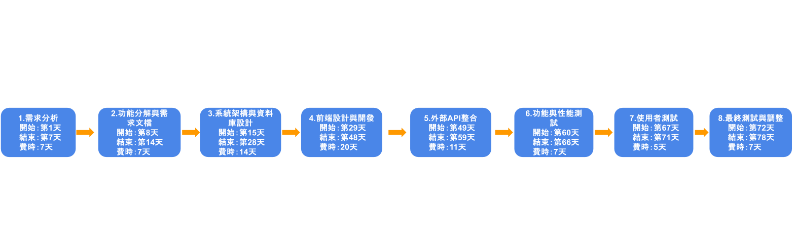
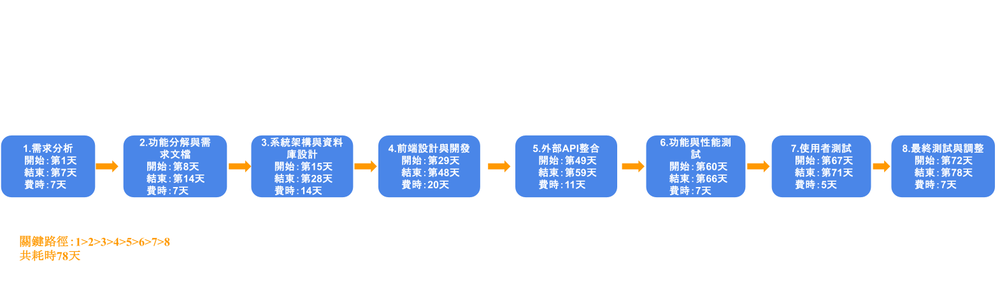

### PERT圖

### 甘特圖

### 關鍵路徑

### 任務模式
| 任務  |      說明       | 需時(天) | 前置任務 | 開始時間 | 結束時間 |         任務模式         |
|:----:|:--------------:|:--------:|:--------:|:--------:|:--------:|:------------------------:|
|  1   | 需求分析           |   7     |    -     |    1     |    7     |       依存             |
|  2   | 功能分解圖與需求文檔|   7     |    1     |    8    |    14     |        依存            |
|  3   | 系統架構與資料庫設計|   14    |    2    |   15    |   28       |      依存              |
|  4   | 前端設計與開發      |  20    |    3      |   29    |   48     |      依存              |
|  5   | 外部 API 整合      |  11    |     4    |  49      |   59     |    依存               |
|  6   | 功能與性能測試     |   7     |     5    |   60     |   66    |     依存               |
|  7   | 使用者測試         |  5     |     6   |    67      |   71    |    依存                |
|  8   | 最終測試與調整     |   7    |     7    |   72     |    78    |     依存               |
